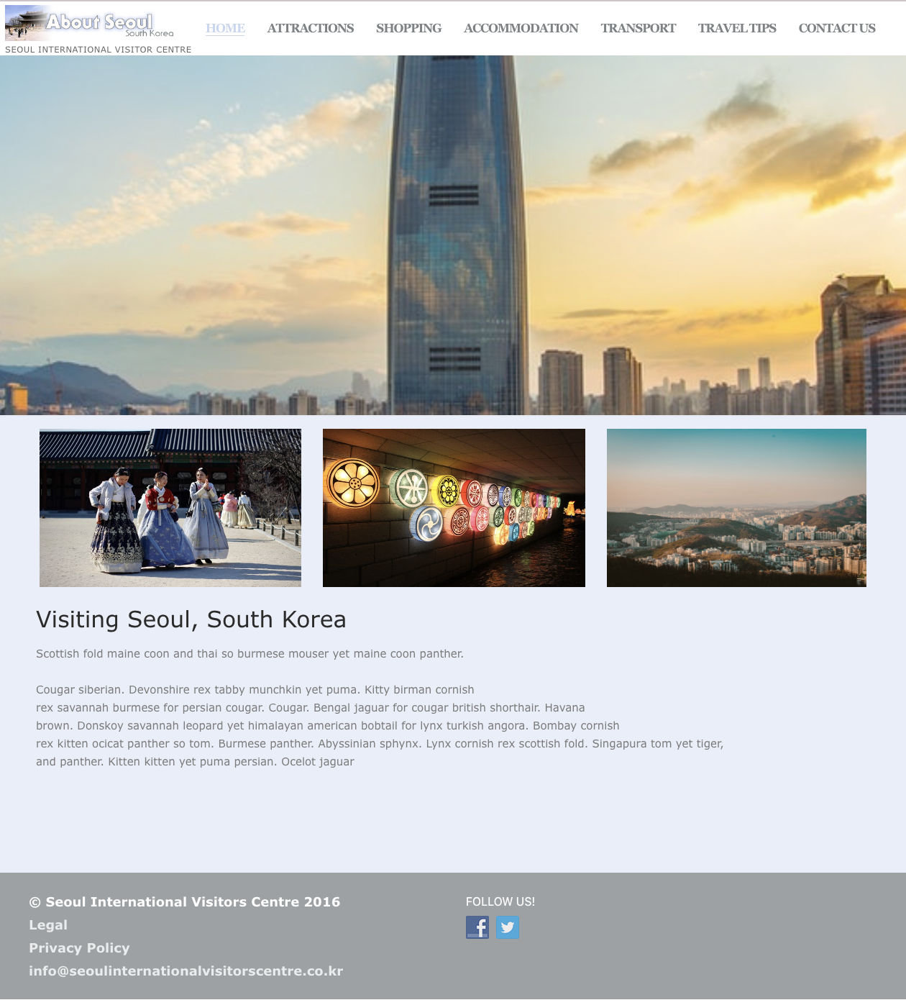
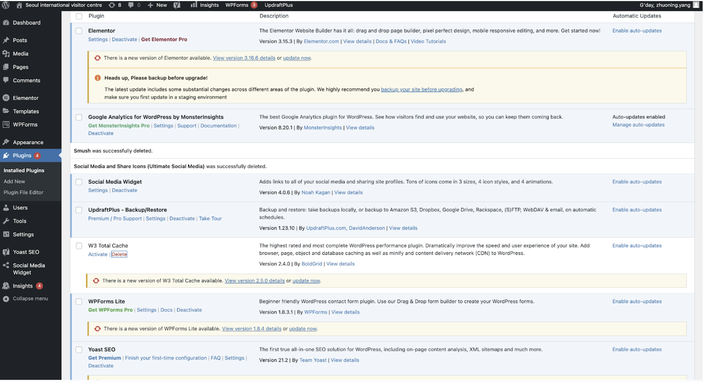
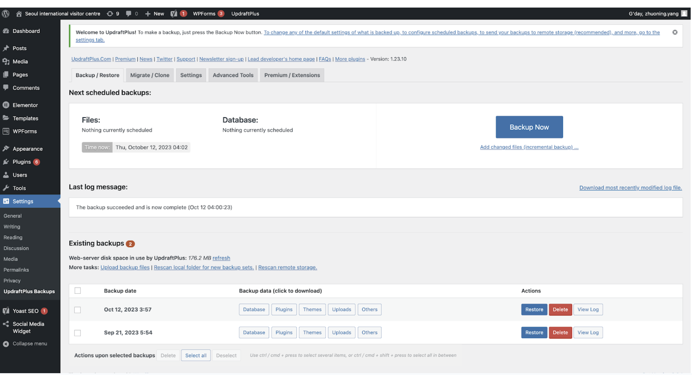
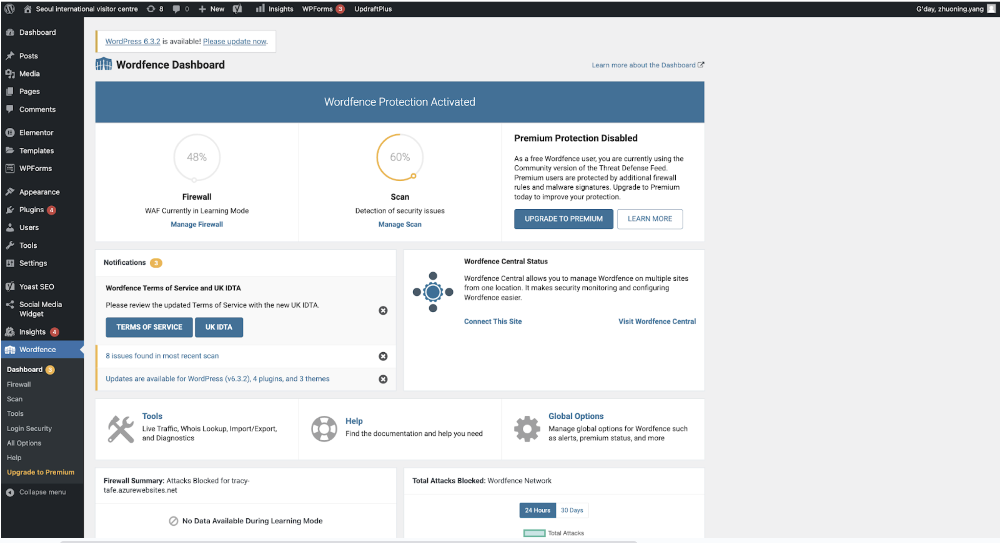
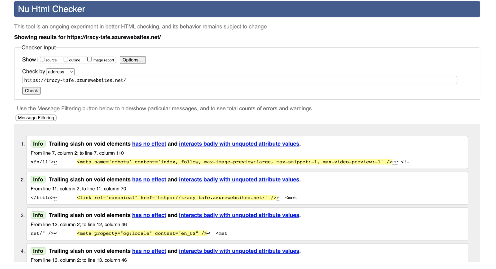

# WordPress Website Project – Seoul International Visitors Centre

## Project Overview
Tourism-focused website built in WordPress for an assignment project. Deliverables included full theme setup, plugin configuration, SEO plan, and responsive design testing.

## Tech Stack
- **CMS**: WordPress  
- **Theme**: Tour Travel Agent (Themescaliber)  
- **Plugins**: Yoast SEO, WPForms, Wordfence Security, WP Go Maps, UltimatelySocial  
- **Tools**: Google Analytics, Google Search Console  

## Highlights
- **Theme**: customized colors, fonts, and branding for tourism scenario  
- **Plugins**: SEO, forms, firewall, maps, social sharing integrated  
- **Tuning**: optimized images (JPG with ALT tags), W3C validation, backup before submission  
- **Design**: responsive layout with planned navigation and wireframes, tested in Chrome and Safari  
- **SEO**: keyword strategy, search engine submissions, content and backlink plan  

## Screenshots  

Inline examples:  
  
  

Additional screenshots:  
-   
-   
-   
-   

## Notes
- Live site access has expired, this README documents the build and project evidence
